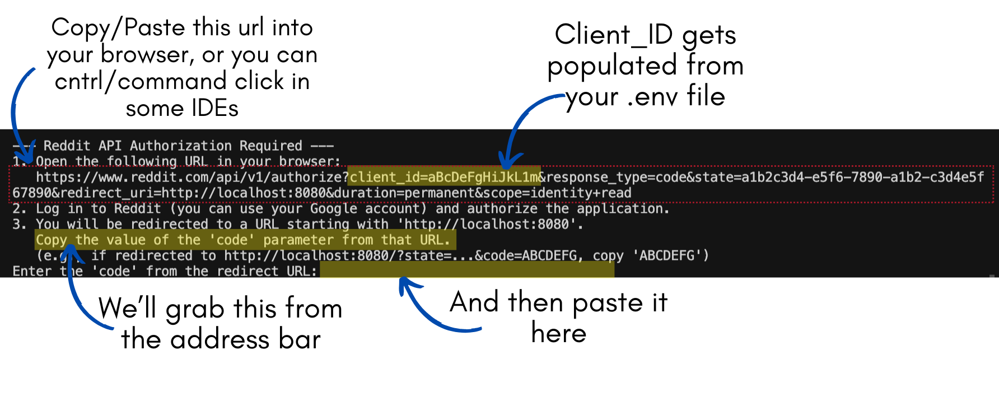
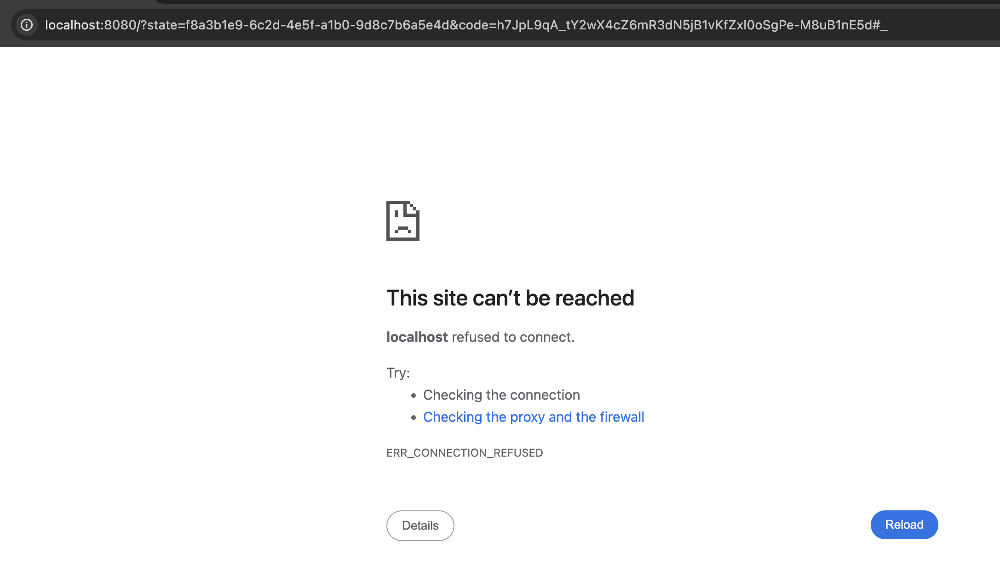
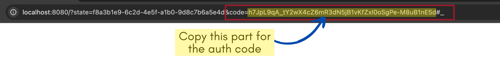
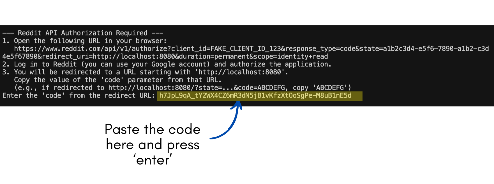
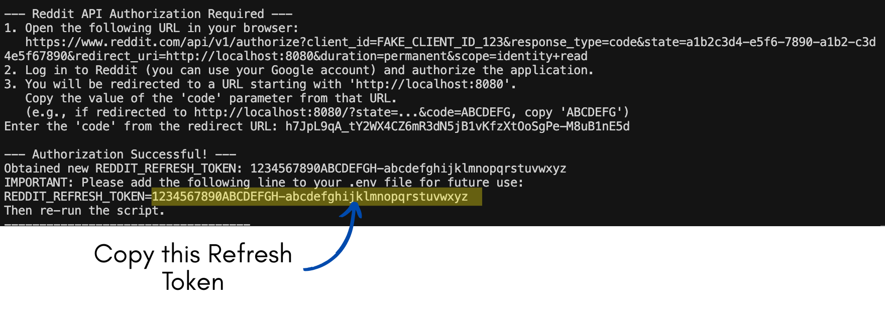
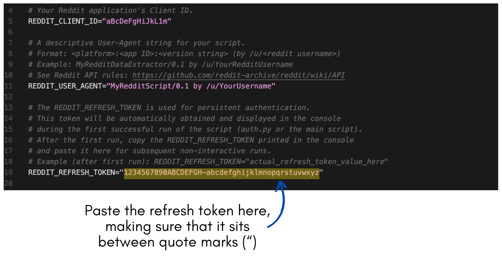

# Reddit Content Extractor

This Python script extracts the main post content and associated comments from a Reddit submission URL and saves the structured data as a JSON file.

It supports both command-line operation for scripting and an interactive mode for ease of use.

## Table of Contents

- [Reddit Content Extractor](#reddit-content-extractor)
  - [Table of Contents](#table-of-contents)
  - [Features](#features)
  - [Understanding the Files](#understanding-the-files)
  - [Setup](#setup)
  - [Usage](#usage)
    - [Interactive Mode](#interactive-mode)
    - [Command-Line Mode](#command-line-mode)
  - [Output Format](#output-format)
  - [Media Download Feature](#media-download-feature)
  - [Technical Notes on Data Retrieval](#technical-notes-on-data-retrieval)

## Features

- Extracts post details (title, author, score, selftext, media info, etc.).
- Extracts comments and their replies up to a specified depth or all replies.
- Supports limiting the number of top-level comments fetched.
- Supports various comment sorting orders (best, top, new, etc.).
- Handles different types of media associated with posts (images, videos, galleries, embeds).
- Provides output in a structured JSON format, including metadata.
- Command-line interface for automation.
- Interactive mode for guided input.
- Robust error handling and retry mechanism for API calls.
- Configurable logging (console and file).

## Understanding the Files

This project is structured into several Python modules for clarity and maintainability. Here's a brief overview of the key files and folders:

- **`README.md`**: (This file) Provides the main overview, setup, and basic usage instructions.
- **`USAGE.md`**: Contains detailed examples and explanations for all command-line arguments.
- **`requirements.txt`**: Lists the necessary Python libraries (dependencies) required to run the script. You install these using `pip install -r requirements.txt`.
- **`.env.example`**: A template file for your API credentials. You should **rename this to `.env`** and fill in your details.
- **`.gitignore`**: Specifies intentionally untracked files that Git should ignore (like `.env`, `venv/`, `__pycache__/`, log files, and output files).
- **`LICENSE.md`**: Contains the MIT license information for the project.
- **`CONTRIBUTING.md`**: Provides guidelines for contributing to the project (if present).

- **`reddit_extractor.py`**: The main entry point of the application. This script handles command-line argument parsing, orchestrates the calls to other modules (authentication, data fetching, formatting, saving), and manages the interactive mode prompts.
- **`auth.py`**: Handles the Reddit API authentication process using OAuth 2.0 (Code Flow). It initializes the connection to Reddit, manages refresh tokens, and guides the user through the first-time authorisation.
- **`url_processor.py`**: Contains functions specifically for validating Reddit URLs and extracting the unique post ID from various URL formats.
- **`data_retriever.py`**: Responsible for fetching the actual post and comment data from the Reddit API using the authenticated client provided by `auth.py`. Includes logic for handling comment sorting, depth limits, and retries for API errors.
- **`output_formatter.py`**: Takes the raw data fetched by `data_retriever.py` and structures it into the final JSON format. It adds metadata (like script version, timestamps) and generates appropriate filenames for the output.
- **`media_downloader.py`**: Handles the optional downloading of media files (images, GIFs, videos without sound) linked in the post or comments when running in interactive mode.
- **`error_handler.py`**: Defines custom error classes specific to this application (e.g., `URLValidationError`, `APIAuthenticationError`) and includes helper functions for formatting user-friendly error messages and determining if an API error is retryable.

- **`examples/`**: Contains example output JSON files and potentially corresponding media download folders, illustrating what the script produces.
- **`Readme_Images/`**: Stores the images used within this `README.md` file for illustration.

## Setup

1. **Clone the Repository:**

    ```bash
    git clone https://github.com/Captain-Bacon/Reddit_Getter.git
    cd Reddit_Getter # Or your cloned directory name
    ```

2. **Environment Setup:**
    - **Using Conda:**

        ```bash
        # Create a new Conda environment (e.g., named 'reddit_extractor')
        conda create -n reddit_extractor python=3.10 # Or desired Python version
        conda activate reddit_extractor
        
        # Install dependencies
        pip install -r requirements.txt
        ```

    - **Using venv:**

        ```bash
        python3 -m venv venv
        source venv/bin/activate # On Windows use `venv\\Scripts\\activate`
        pip install -r requirements.txt
        ```

3. **Setting Up Your Reddit Application:**
    To use this script, you need to register a "script" type application on Reddit. This will provide you with the necessary API credentials.

    - Go to your Reddit App Preferences: [https://www.reddit.com/prefs/apps/](https://www.reddit.com/prefs/apps/)
    - Scroll down to the bottom and click "are you a developer? create an app..."
    - Fill out the form:
        - **Name:** Give your app a descriptive name (e.g., "MyRedditContentExtractor").
        - **Type:** Select the "**installed app**" radio button.
            - *(Image placeholder: Screenshot highlighting the "installed app" option)*
        - **Description:** (Optional) You can leave this blank or add a short description.
        - **About URL:** (Optional) You can leave this blank or link to this GitHub repository.
        - **Redirect URI:** This is important! Enter `http://localhost:8080`. This exact URI is used by the script to receive the authorization code from Reddit.
    - Click the "create app" button.
    - After creation, your app will be listed. Under its name, you will see a string of characters – this is your **Client ID**. A "secret" may also be displayed, but **this script does not use the client secret.**
        - *(Image placeholder: Screenshot of an app entry showing where the Client ID is located)*
    - Make a note of your **Client ID**. You'll need it for the next step.
    - **Note on Logging In:** When the script directs you to Reddit to authorize the app, you can log in using your standard Reddit username and password, or by using Google/Apple sign-in if your Reddit account is linked to them.

4. **Configure API Credentials (`.env` file):**
    - In the project root directory, you'll find a file named `.env.example`.
    - Rename `.env.example` to `.env`, then open it and fill in the required values as described below:

        ```dotenv
        # .env file content (example)
        REDDIT_CLIENT_ID="YOUR_CLIENT_ID_FROM_REDDIT_APP_SETTINGS"
        REDDIT_USER_AGENT="YourAppName/1.0 by /u/YourRedditUsername" # Be specific and unique!
        REDDIT_REFRESH_TOKEN=""
        ```

    - **`REDDIT_CLIENT_ID`**: Paste the Client ID you obtained from your Reddit app settings in the previous step.
    - **`REDDIT_USER_AGENT`**: Create a unique and descriptive User-Agent string. Reddit requires this for API access, and it helps them identify your script. A good format is `<AppName>/<Version> by /u/<YourRedditUsername>` (e.g., `MyRedditExtractor/0.1 by /u/MyRedditUsername`). **Replace `/u/YourRedditUsername` with your actual Reddit username.** Using a generic or non-unique User-Agent can lead to your script being rate-limited or blocked.
    - **`REDDIT_REFRESH_TOKEN`**: Leave this blank for now. The script will help you obtain this the first time you run it.

5. **First-Time Authorisation (Getting the Refresh Token):**
    The very first time you run the script (e.g., by typing `python reddit_extractor.py` in your terminal) with the `REDDIT_REFRESH_TOKEN` field empty in your `.env` file, the script needs your permission to access Reddit on your behalf. It does this using a standard process called OAuth.

    > **What to expect:** If you've never used OAuth before, don't worry! You'll be copying and pasting a few things between your browser, terminal, and your `.env` file. The screenshots below show exactly what to do.

    You will be guided through these steps in your terminal:

    1. **Authorisation URL:** The script will display an authorisation URL in your console. Copy this URL.

        

    2. **Browser Authorisation:** Paste the URL into your web browser. You'll be taken to Reddit. Log in if necessary (you can use your standard Reddit login or linked Google/Apple accounts) and click "Allow" or "Accept" to authorise the script.
    3. **Redirect to Localhost:** After authorisation, Reddit will redirect your browser to a URL starting with `http://localhost:8080/...`.
    4. **"Site Can't Be Reached" - This is Normal:** Your browser will almost certainly display an error message like "This site can't be reached" or "Connection refused" for the `localhost:8080` address. **This is expected behaviour.** The script isn't running a web server; the redirect is simply how Reddit passes the necessary authorisation `code` back to you.

        

    5. **Copy the Authorisation Code:** The important part is now in your browser's **address bar**. Look for the `code=` parameter in the URL. You need to copy the **entire value** that comes *after* `code=` and *before* any subsequent `&` or the final `#_`.
        *(Optional closer view of the code in the address bar)*

        

    6. **Paste Code into Script:** Go back to your terminal. The script will be waiting with a prompt like: `Enter the 'code' from the redirect URL:`. Paste the `code` you just copied from the browser's address bar here and press Enter.

        

    7. **Get the Refresh Token:** If the `code` is correct, the script will use it to get a long-term **Refresh Token** from Reddit. This token will be clearly printed in your terminal.

        

    8. **Update `.env` File:** Copy this entire **Refresh Token** value. Open your `.env` file again and paste the token as the value for `REDDIT_REFRESH_TOKEN`. Make sure it's enclosed in quotes if it contains special characters, although it usually doesn't. For example:
        `REDDIT_REFRESH_TOKEN="actual_long_refresh_token_string_here"`

        

    9. **Save `.env`:** Save the changes to your `.env` file.

    Now, on all future runs, the script will use the saved Refresh Token to authenticate automatically without needing you to go through the browser authorisation again.

    > **You're all set!** You can now run the script any time and it will authenticate automatically.

## Usage

The script can be run via the command line or interactively.

For detailed command-line examples and argument explanations, please see the dedicated [USAGE.md](USAGE.md) guide.

### Interactive Mode

If you run the script without any arguments (or only logging arguments like `-v`), it will enter interactive mode:

```bash
python reddit_extractor.py
```

The script will prompt you for:

- The Reddit post URL.
- Comment fetching preference (Number, `all`, or `no`).
- Comment sort order (if fetching comments).
- Comment depth limit (if fetching comments). Remember, depth is zero-indexed (0 = top-level only).
- Output filename (optional, leave blank to auto-generate).
- Whether to print output to the console instead of saving.
- **Include verbose raw media details?** (Default: No) - Reddit's API often provides extensive technical details about media items (like *all* available resolutions/sizes for each image in a gallery, internal metadata objects, etc.). By default, the script includes only essential, structured information. Enabling this option includes *all* the raw data provided by the API. **Warning:** This can make the output JSON file significantly larger, especially for posts with galleries. Only enable this if you specifically need deep technical details or access to every single media version; otherwise, the default setting is recommended.
- **Media Download Prompts (if applicable):** After the above steps, if downloadable media is detected in the post or comments, you will be asked if you want to download it and from where (post only, comments only, or both). See the [Media Download Feature](#media-download-feature) section for details.

### Command-Line Mode

Provide the Reddit post URL using the `--url` argument. Other options control comment retrieval and output.

```bash
python reddit_extractor.py --url <reddit_post_url> [options]
```

**Common Options:**

- `--url <URL>`: (Required) The full URL of the Reddit post.
- `--comments <N>`: Get the top `N` comments. Use `0` for no comments.
- `--all-comments`: Get all top-level comments (default if no comment option specified).
- `--no-comments`: Do not fetch any comments.
- `--sort <order>`: Comment sort order (`best`, `top`, `new`, `controversial`, `old`, `q&a`). Default: `best`.
- `--depth <D>`: Maximum reply depth to fetch. Default: all depths. Note: Depth is zero-indexed; `--depth 0` fetches top-level comments only (no replies), `--depth 1` fetches top-level comments and their direct replies, etc.
- `--output <filename.json>` or `-o <filename.json>`: Specify the output JSON filename. If omitted, a name is generated based on post ID and title.
- `--print`: Print the final JSON to the console instead of saving to a file.
- `--verbose` or `-v`: Enable detailed DEBUG level logging to the console.
- `--log-file <filepath>`: Save logs to the specified file (appends).
- `--include-raw-media`: Include extensive raw media metadata from PRAW (e.g., all image resolutions, full gallery data). This can significantly increase file size. Off by default.

**Examples:**

1. **Fetch post and all comments, save to auto-generated file:**

    ```bash
    python reddit_extractor.py --url https://www.reddit.com/r/some_subreddit/comments/post_id/post_title/
    ```

2. **Fetch post and top 50 comments (sorted by new), save to `output.json`:**

    ```bash
    python reddit_extractor.py --url <URL> --comments 50 --sort new -o output.json
    ```

3. **Fetch post only (no comments), print JSON to console:**

    ```bash
    python reddit_extractor.py --url <URL> --no-comments --print
    ```

4. **Fetch all comments up to depth 2, enable verbose logging:**

    ```bash
    python reddit_extractor.py --url <URL> --all-comments --depth 2 -v 
    ```

## Output Format

The script outputs a JSON file containing structured information about the post and its comments. Here's a simplified example illustrating the key fields:

```json
{
  // --- Metadata ---
  "extractor_version": "0.1.0",           // Version of the script used
  "extraction_timestamp_utc": "2025-05-12T10:59:23.026915+00:00", // ISO 8601 timestamp of extraction
  "source_url": "https://www.reddit.com/r/aviation/comments/pcy6v7/...", // Permalink to the original Reddit post

  // --- Post Details ---
  "post_details": {
    "id": "pcy6v7",                         // Reddit's unique post ID
    "title": "What is your favourite fact about the legendary Lockheed SR-71...", // Post title
    "author": "Mean-Juggernaut1560",        // Author's Reddit username
    "created_utc": 1630105229.0,            // Unix epoch timestamp of post creation
    "url": "https://i.redd.it/1j7mmhv8ezj71.jpg", // Direct URL (often to media, or self-post URL)
    "permalink": "https://www.reddit.com/r/aviation/comments/pcy6v7/...", // Full permalink again
    "domain": "i.redd.it",                   // Domain of the main URL (e.g., i.redd.it, self.subreddit, v.redd.it)
    "selftext": "",                         // Body text of the post (empty if it's a link/media post)
    "score": 4736,                          // Net score (upvotes - downvotes)
    "upvote_ratio": 0.95,                   // Ratio of upvotes to total votes
    "num_comments": 770,                    // Number of comments reported by Reddit at time of fetch
    "is_original_content": false,           // Boolean flag
    "is_self": false,                       // True if it's a text-only post (self-post)
    "is_video": false,                      // True if Reddit identifies the main link as a video
    "over_18": false,                       // NSFW flag
    "spoiler": false,                       // Spoiler flag
    "locked": false,                        // Locked post flag
    "subreddit": "aviation",                // Subreddit name
    "subreddit_id": "t5_2qhu8",             // Subreddit's unique ID
    "gilded": 1,                            // Number of times gilded (Reddit Gold/Awards)

    // -- Media Information (list, as some posts have multiple items e.g., galleries) --
    "media_info": [
      {
        "type": "image",                    // Type identifier (image, reddit_video, youtube_video_embed, etc.)
        "url": "https://i.redd.it/1j7mmhv8ezj71.jpg", // Primary URL for the media
        "width": 1242,                      // Media width (if available)
        "height": 1291                      // Media height (if available)
        // Other type-specific fields might appear here (e.g., fallback_url, hls_url for videos)
      }
    ],
    "created_iso": "2021-08-27T23:00:29+00:00" // ISO 8601 formatted creation timestamp
  },

  // --- Comments Section (List of top-level comments) ---
  "comments": [
    { // --- Top-Level Comment Object ---
      "id": "hamg6gr",                      // Comment's unique ID
      "author": "Spiffytown",               // Comment author's username
      "body": "Turning radius: About 5 states", // The comment text
      "created_utc": 1630109018.0,          // Unix epoch timestamp of comment creation
      "score": 1235,                        // Comment's net score
      "is_submitter": false,                // True if comment author is the post author
      "stickied": false,                    // True if comment is stickied by mods
      "parent_id": "t3_pcy6v7",             // ID of the parent (t3_ prefix = post, t1_ prefix = another comment)
      "permalink": "https://www.reddit.com/r/aviation/comments/pcy6v7/.../hamg6gr/", // Full permalink to comment
      "depth": 0,                           // Depth level (0 = top-level reply to post)
      "created_iso": "2021-08-28T00:03:38+00:00", // ISO 8601 formatted creation timestamp

      // -- Replies to this comment (nested list, recursive structure) --
      "replies": [
        { // --- Reply Comment Object (Depth 1) ---
          "id": "hamq4ae",
          "author": "Mean-Juggernaut1560",
          "body": "Turning radius: France",
          "created_utc": 1630113950.0,
          "score": 596,
          "is_submitter": true,            // This comment IS by the post's original submitter
          "stickied": false,
          "parent_id": "t1_hamg6gr",        // Parent is the comment above (t1_ prefix)
          "permalink": "https://www.reddit.com/r/aviation/comments/pcy6v7/.../hamq4ae/",
          "depth": 1,                      // Depth level 1
          "created_iso": "2021-08-28T01:25:50+00:00",
          "replies": [
            // Further nested replies would appear here...
            // If --depth limit was reached, this list would be empty []
          ]
        },
        // ... other replies to the top-level comment ...
      ]
    },
    // ... other top-level comments ...
  ]
}
```

Key points about the structure:

- **Timestamps:** `created_utc` provides the raw Unix epoch time, while `created_iso` offers a human-readable ISO 8601 format.
- **Media:** `post_details.media_info` is a list containing objects for each detected media item (images, videos, embeds). The `type` field helps identify the kind of media. If the `--include-raw-media` flag is used, additional fields prefixed with `_raw_` containing extensive PRAW metadata will appear within `post_details`.
- **Comments:** The `comments` list contains top-level comment objects. Each comment object has a `replies` field which is itself a list containing replies to *that* comment, creating a nested structure. The `depth` field indicates the nesting level (0 for direct replies to the post).

## Media Download Feature

This script can optionally download media (images, GIFs, and some videos) from the main post and/or comments **when running in interactive mode.**

**How it works:**

- After the main data extraction is complete and the JSON output is ready (either printed or saved), the script checks for potential media URLs.
- For the **main post**, it looks at the structured `media_info` within the `post_details` section of the JSON, extracting URLs for types like `image` and `reddit_video` (if they point directly to downloadable files like `.jpg`, `.png`, `.gif`, `.mp4`).
- For **comments**, it scans the `body` text of each fetched comment (and its replies) for direct links to Reddit's media hosting domains (`i.redd.it`, `preview.redd.it`) that end in common image extensions (`.jpg`, `.jpeg`, `.png`, `.gif`).
- If any potential media URLs are found, you will be prompted to confirm if you want to download them and specify the scope (post, comments, or both).
- Downloaded media files are saved into a **new folder** created in the same directory as the output JSON file. This folder will have the **same name as the JSON file (without the `.json` extension)**. For example, if the output is saved as `my_post_output.json`, media will be saved in a folder called `my_post_output/`.

**Limitations for Reddit Videos:**

- Reddit-hosted videos downloaded by this script will **not have sound**. This is because Reddit stores video and audio as separate files/streams, and this script currently only downloads the primary video stream (typically the `.mp4` file found in the media info).
- Images and GIFs are downloaded as expected.

## Technical Notes on Data Retrieval

This script utilises the [PRAW (Python Reddit API Wrapper)](https://praw.readthedocs.io/en/stable/) library to interact with the official Reddit API. Understanding a little about how PRAW fetches data, particularly comments, can be helpful:

- **Comment Limits (`
